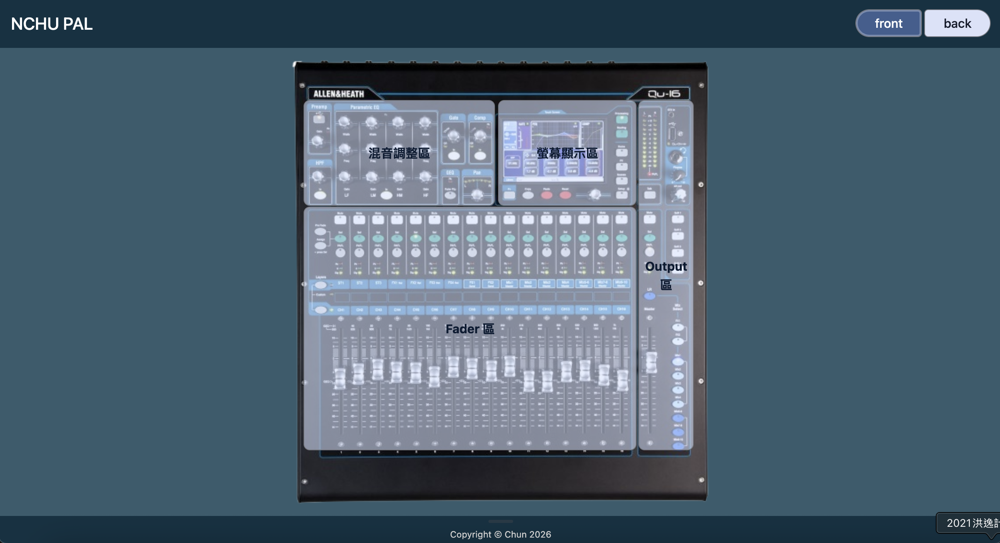

# QU-16 teaching web

此網站是以 **Allen & Heath QU-16 數位混音控台**為主題的互動式操作導覽網站，透過 React 建立可點擊的控台介面，讓使用者能從實際面板位置逐步查看不同功能區域與控制元件的操作資訊。

---

## Project Motivation｜專案發想

在校內聲光設備操作與教學過程中，發現初次接觸數位混音控台的使用者，即使能透過操作手冊查詢功能，仍需要先知道功能名稱或自行在大量文字與圖片中尋找對應位置，對不熟悉控台介面的人而言具有一定的學習門檻。

因此，本專案嘗試將傳統以文字為主的操作文件轉換為**以實際設備介面為入口的互動式導覽**。

使用者若忘記上課教的控台作用，可以直接從 QU-16 控台圖片回想，點擊所需區域，查看物件的功能
操作方式：

```text
找到實際面板位置
        ↓
選擇主要功能區域
        ↓
放大對應區域
        ↓
選擇特定控制元件
        ↓
查看功能與操作資訊
```

網站因此將 QU-16 的資訊依照：

```text
Panel → Area → Part → Detail
```

進行分層，讓使用者能從「控制元件在哪裡」逐步連結到「它是什麼、如何操作」。
---
## Preview｜介面預覽


---
## Technologies｜使用技術

### React

使用 React 建立元件化的互動介面，將網站拆分為 `Header`、`PanelSwitch`、`MixerViewer`、`BigHotSpot`、`SmallHotSpot` 與 `Footer` 等元件。

並透過 React State 管理主要導覽狀態：

```text
side → area → part
```

使介面能依照使用者目前選擇的面板、功能區域與控制元件動態更新。

### JavaScript / JSX

負責網站主要互動邏輯，包括：

- Front / Back 面板切換
- HotSpot 動態產生
- Area / Part 狀態管理
- 區域縮放控制
- 返回層級控制
- Browser History 整合
- `Esc` 鍵返回操作

### JSON

使用 `MixerData.json` 集中管理 QU-16 控台資料，包括：

```text
label
zoomClass
position
parts
function
step
warning
```

將**控台資料**與**React 顯示邏輯**分離，使控制區域、HotSpot 座標與操作資訊可以獨立維護。

### CSS

使用 CSS 處理：

- 控台圖片顯示
- HotSpot 定位
- 百分比座標
- Area Zoom
- Transition
- Part Information Panel
- Responsive Layout

各 HotSpot 的位置與尺寸主要使用百分比表示，使標示位置能與控台圖片維持對應關係。

### Tailwind CSS / DaisyUI

專案環境中導入 Tailwind CSS 與 DaisyUI，作為介面樣式與元件設計的輔助工具。

### Vite

使用 Vite 作為 React 專案的開發與建置工具，提供本地開發伺服器與 production build。

---

## Features

## Features

### Front / Back Panel Switching

使用者可透過 Panel Switch 切換 QU-16 的正面與背面，查看不同控制區域與連接介面。

### Interactive Area Navigation

控台依功能劃分為不同主要區域，並透過 **BigHotSpot** 顯示於控台圖片上。

點擊主要區域後，畫面會放大至對應位置。

### Multi-level HotSpot

網站採用兩層 HotSpot 建立分層式操作導覽：

```text
QU-16 Panel
      ↓
 BigHotSpot
      ↓
  Area Zoom
      ↓
SmallHotSpot
      ↓
 Part Detail
```

第一層用於選擇主要功能區域，第二層則進一步選擇區域中的特定控制元件。

### Part Information

點擊 SmallHotSpot 後，網站會以資訊面板顯示該控制元件的相關資訊，包括：

- 元件名稱
- 操作方式
- 功能說明
- 注意事項

### Navigation

網站支援多種返回方式：

- 畫面返回按鈕
- 瀏覽器上一頁
- `Esc` 鍵

使用者可依序由 Part 返回 Area，再返回完整控台畫面。

---

## Interaction Flow

網站主要以三個狀態控制互動流程：

```text
side
 ↓
area
 ↓
part
```

### `side`

控制目前顯示的 QU-16 面板：

```text
front / back
```

`side` 由上層元件管理，再傳入 `MixerViewer`。

### `area`

記錄目前選擇的主要功能區域。

當：

```js
area === null
```

網站顯示完整控台以及所有 BigHotSpot。

選擇區域後：

```js
setArea(areaKey)
```

`MixerViewer` 會根據對應資料套用縮放設定，顯示該區域中的 SmallHotSpot。

### `part`

記錄目前選擇的控制元件。

點擊 SmallHotSpot 後：

```js
setPart(partKey)
```

系統讀取對應元件資料，並顯示操作、功能與注意事項。

---

## Component Structure

```text
App
│
├── Header
│
├── PanelSwitch
│
├── MixerViewer
│   ├── BigHotSpot
│   ├── SmallHotSpot
│   └── Part Information
│
└── Footer
```

### `App.jsx`

網站主要上層元件，負責組合頁面元件及管理目前顯示的面板 `side`。

### `PanelSwitch.jsx`

提供 Front / Back 面板切換功能，更新 `side` 狀態。

### `MixerViewer.jsx`

主要互動邏輯所在元件，負責：

- 根據 `side` 載入正面或背面圖片
- 讀取 `MixerData.json`
- 管理 `area`
- 管理 `part`
- 產生 BigHotSpot
- 產生 SmallHotSpot
- 控制區域縮放
- 顯示 Part Information
- 管理返回導覽行為

### `BigHotSpot.jsx`

顯示控台上的主要功能區域。

由 `MixerViewer` 傳入：

```text
title
position
onClick
```

其中：

- `title`：顯示區域名稱
- `position`：控制 HotSpot 在圖片上的位置與尺寸
- `onClick`：選擇對應 Area

### `SmallHotSpot.jsx`

顯示 Area 中可進一步選擇的控制元件。

由 `MixerViewer` 傳入對應元件資訊與點擊行為。

---

## Data Structure

QU-16 的介面資料集中管理於：

```text
src/components/MixerData.json
```

資料首先依面板區分：

```text
MixerData
├── front
│   └── Area
│       └── parts
│
└── rear
    └── Area
        └── parts
```

主要 Area 資料包含：

```json
{
  "label": "...",
  "zoomClass": "...",
  "position": {},
  "parts": {}
}
```

其中：

- `label`：顯示於 BigHotSpot 的名稱
- `zoomClass`：控制點擊 Area 後的圖片縮放與位移
- `position`：BigHotSpot 的位置與尺寸
- `parts`：該 Area 中的控制元件

Part 資料可包含：

```json
{
  "label": "...",
  "function": "...",
  "step": "...",
  "warning": "...",
  "position": {}
}
```

其中：

- `label`：元件名稱
- `function`：功能說明
- `step`：操作方式
- `warning`：注意事項
- `position`：SmallHotSpot 的位置與尺寸

HotSpot 的位置主要以百分比表示，使標示區域能對應控台圖片的位置。

---

## Tech Stack

- React
- JavaScript
- JSX
- CSS
- JSON
- Vite
- Tailwind CSS
- DaisyUI
- Material Symbols

---

## Project Structure

```text
qu16-viewer/
│
├── public/
│   ├── images/
│   │   ├── qu-front.png
│   │   ├── qu-front-old.jpg
│   │   ├── qu-back.png
│   │   └── qu-back.jpg
│   ├── icons.svg
│   └── favicon.svg
│
├── src/
│   ├── assets/
│   │   ├── hero.png
│   │   ├── react.svg
│   │   └── vite.svg
│   │
│   ├── components/
│   │   ├── BigHotSpot.jsx
│   │   ├── Footer.jsx
│   │   ├── Footer.css
│   │   ├── Header.jsx
│   │   ├── Header.css
│   │   ├── MixerData.json
│   │   ├── MixerViewer.jsx
│   │   ├── MixerViewer.css
│   │   ├── PanelSwitch.jsx
│   │   ├── PanelSwitch.css
│   │   └── SmallHotSpot.jsx
│   │
│   ├── App.jsx
│   ├── App.css
│   ├── index.css
│   └── main.jsx
│
├── .gitignore
├── eslint.config.js
├── index.html
├── package.json
├── package-lock.json
├── vite.config.js
└── README.md
```

`dist/` 為 Vite build 後產生的輸出內容，`node_modules/` 為安裝的套件，因此未列入主要專案結構。

---

## Getting Started

### 1. Clone the repository

```bash
git clone <repository-url>
cd <project-folder>
```

### 2. Install dependencies

```bash
npm install
```

### 3. Start the development server

```bash
npm run dev
```

啟動成功後，依終端機顯示的 Local URL 於瀏覽器開啟網站。

### 4. Build the project

```bash
npm run build
```

完成後，build 結果會產生於：

```text
dist/
```
---

## Author

**Chun 2026**
